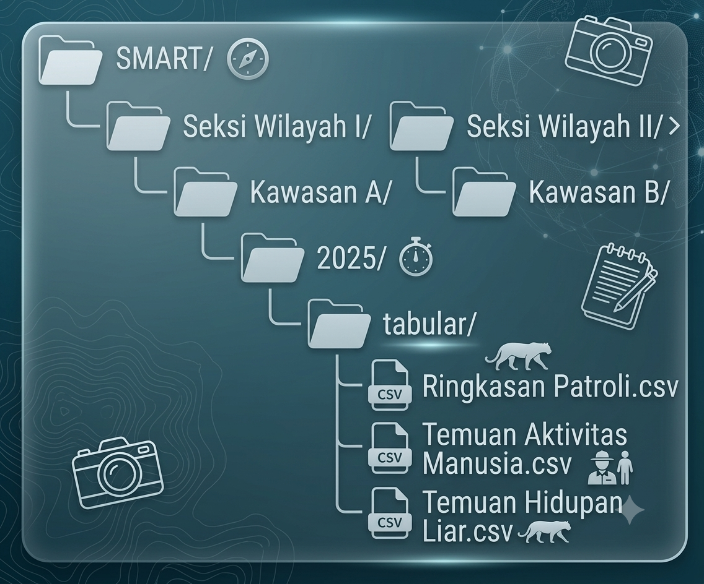

```{r setup, include=FALSE}
knitr::opts_chunk$set(
	echo = TRUE,
	error = FALSE,
	fig.align = "center",
	fig.height = 6,
	fig.width = 10,
	message = FALSE,
	warning = FALSE,
	cache = TRUE
)
library(dplyr, quietly = TRUE, warn.conflicts = FALSE)
library(sf, quietly = TRUE, warn.conflicts = FALSE)
library(lubridate, quietly = TRUE, warn.conflicts = FALSE)
library(readr, quietly = TRUE, warn.conflicts = FALSE)
library(knitr, quietly = TRUE, warn.conflicts = FALSE)

# Main path Configuration ------
base_path        <- "D:/0_DataCentre"
analysis         <- file.path(base_path, "2_Analysis/01_smart_generate")
nationaldb       <- file.path(base_path, "1_Database")
nationaldb_smart <- file.path(nationaldb, "SMART")
output           <- file.path(analysis, "output")
data_folder      <- file.path(analysis, "data")

load(file.path(data_folder, "smart_generate_data.RData"))
source(file.path(analysis, "code/source", "1_fn_smart_data.r"))

```

# Introduction

## Background

Systematic biodiversity monitoring is essential for assessing protected area management effectiveness and detecting emerging threats (@hockings2015). The Spatial Monitoring and Reporting Tool (SMART) has become a global standard for patrolling and data management in conservation areas (@stokes2010). SMART integrates spatial data collection with structured reporting, enabling rangers to document wildlife observations, human activities, and patrol efforts systematically across diverse conservation landscapes.

## Purpose of This Pipeline

1.  Standardize Data Processing: Automate cleaning and transformation of raw SMART export files into analysis-ready formats
2.  Integrate Spatial Data: Process patrol track shapefile to calculate spatial metrics including patrol distances
3.  Hierarchical Organization: Distribute processed data into region → site → session directory structures based on existing data attributes
4.  Ensure Reproducibility: Provide fully documented code with automated dependency management
5.  Facilitate Reporting: Generate structured outputs compatible with conservation reporting frameworks

## Data Types Processed

The pipeline handles three primary data categories derived from SMART patrol operations:

| **Data Category** | **Description** | **Key Variables** |
|:-----------------|:-------------------|:---------------------------------|
| ^**Patrol Summary**^ | ^Spatial tracks and patrol effort metrics^ | ^Distance, patrol duration, team composition, transport mode^ |
| ^**Threat Records**^ | ^Human activity observations^ | ^Threat type, quantity, status, coordinates^ |
| ^**Biodiversity Records**^ | ^Wildlife and flora observations^ | ^Species identification (local and scientific names), counts, condition^ |

# System Requirements and Setup

## Software Requirements

The pipeline requires the following software environment:

- R Version: 4.0 or higher (R Core Team, 2024)
- RStudio: Recommended for script execution and development
- RTools (Windows): Required for compiling spatial packages
- Operating System: Windows 10/11, macOS, or Linux

## Directory Structure

The pipeline follows a standardized directory structure that separates raw data, analysis scripts, and outputs:

```{r}
#| label: fig-directory
#| fig-cap: "Complete directory structure of the SMART data processing pipeline showing data flow from input to output"
#| fig-width: 6.5
#| fig-height: 6
#| out-width: "80%"
#| echo: false

knitr::include_graphics("images/path_foldering_2.png")
```

## Directory Components

```{r}
#| label: component-table
#| tbl-cap: "Directory Components"
#| echo: false

library(kableExtra)

df <- data.frame(
  Component = c("**Input Database**", "**Analysis Scripts**", 
                "**Source Functions**", "**Output Data**", "**Documentation**"),
  Path = c("`1_Database/SMART/All Observation/`", 
           "`2_Analysis/01_Data_generate/`",
           "`code/source/`", 
           "`data/` & `output/`", 
           "`*.qmd`"),
  Purpose = c("Raw SMART CSV and shapefile exports",
              "Main execution and function scripts",
              "Core helper functions for data processing",
              "Processed results and intermediate files",
              "Reproducible workflow documentation")
)

# Untuk HTML
kable(df, format = "html", escape = FALSE) %>%
  kable_styling(font_size = 9, bootstrap_options = "condensed")
```

## Required R Packages

The pipeline depends on several R packages for data manipulation, spatial analysis, and date/time processing (Wickham et al., 2019; Pebesma, 2018; Grolemund & Wickham, 2011).

Core Packages

```{r corepackages}
packages_table <- data.frame(
  Package = c("dplyr", "sf", "lubridate", "readr", "janitor", "hms", "tidyr", "purrr"),
  Version = sapply(c("dplyr", "sf", "lubridate", "readr", "janitor", "hms", "tidyr", "purrr"), 
                   function(pkg) as.character(packageVersion(pkg))),
  Purpose = c(
    "Data manipulation and transformation",
    "Spatial data handling and shapefile processing",
    "Date and time parsing and arithmetic",
    "Efficient CSV reading and writing",
    "Column name cleaning and data validation",
    "Time format handling (HH:MM:SS)",
    "Data reshaping and tidying",
    "Functional programming and iteration"
  )
)

kable(packages_table, caption = "Core R packages used in the pipeline", 
      booktabs = TRUE, format = "markdown")
```

## Installation Verification

Run the following code to verify all required packages are properly installed:

```{r librun}
library(dplyr, quietly = TRUE, warn.conflicts = FALSE)
library(sf, quietly = TRUE, warn.conflicts = FALSE)
library(lubridate, quietly = TRUE, warn.conflicts = FALSE)
library(readr, quietly = TRUE, warn.conflicts = FALSE)
library(janitor, quietly = TRUE, warn.conflicts = FALSE)
library(hms, quietly = TRUE, warn.conflicts = FALSE)

# List required packages
required_pkgs <- c("dplyr", "sf", "lubridate", "readr", "janitor", "hms")

# Check installation status
installed_status <- sapply(required_pkgs, function(pkg) {
  if (require(pkg, character.only = TRUE, quietly = TRUE, warn.conflicts = FALSE)) {
    "✓ Installed"
  } else {
    "✗ Missing"
  }
})

# Create output table
result_df <- data.frame(
  Package = required_pkgs, 
  Status = installed_status
)

# Print as markdown table
kable(result_df, caption = "Package Installation Status", booktabs = TRUE)
```

# Function Reference

## Core Functions Overview

The pipeline implements three main functional modules: data cleaning, spatial processing, and data distribution. Table @tbl-functions summarizes the core functions.

```{r}
#| label: tbl-functions
#| tbl-cap: "Core pipeline functions and their specifications"
#| echo: false

functions_df <- data.frame(
  Function = c("clean_patrol_summary()", "summary_patrol_data()", 
               "threats_patrol_data()", "ff_patrol_data()"),
  Input = c("Shapefile path, landscape name", "Patrol summary data frame, output path",
            "Threats data frame, output path", "Flora/fauna data frame, output path"),
  Output = c("Cleaned data frame with distance metrics", 
             "CSV files organized by region/site/session",
             "CSV files organized by region/site/session", 
             "CSV files organized by region/site/session"),
  Purpose = c("Process patrol track shapefile and calculate distances",
              "Distribute patrol summaries to hierarchical folders",
              "Distribute human activity threat records", 
              "Distribute wildlife and flora observations")
)

kable(functions_df, booktabs = TRUE, format = "markdown")
```

## Data Cleaning Function

*clean_patrol_summary()* This function processes raw SMART patrol shapefiles, calculating spatial metrics and standardizing attributes.

Function Signature:

```{r excleanpsum, eval=FALSE, include=TRUE}
#| message: false
#| warning: false
clean_patrol_summary(file_path, landscape)
```

Arguments:

| **Argument** | **Type** | **Description** |
|:------------------|:------------------|:---------------------------------|
| ^`file_path`^ | ^Character^ | ^Full path to the `.shp` shapefile^ |
| ^`landscape`^ | ^Character^ | ^Landscape name (e.g., "BKSDA Kalimantan Barat")^ |

Return Value: A data frame with cleaned patrol summary data containing:

- All original attributes (converted to lowercase)
- *distance_m*: Patrol distance in meters (rounded to 2 decimals)
- *distance_km*: Patrol distance in kilometers (rounded to 2 decimals)

Processing Steps:

1.  Validation: Checks file existence and readable format
2.  Spatial Reading: Imports shapefile using sf::st_read()
3.  Distance Calculation: Computes line lengths using st_length()
4.  Column Management: Drops unnecessary columns (Patrol_L_1, Patrol_L_2, Armed, Patrol_Leg)
5.  Format Conversion: Converts spatial object to standard data frame
6.  Standardization: Converts all column names to lowercase

Computational Note: The function assumes the shapefile uses a projected coordinate system with units in meters. For geographic coordinate systems (WGS84), st_length() returns great-circle distances in meters (Karney, 2013).

## Data Distribution Functions

### Hierarchical Organization Principle

All distribution functions implement a consistent hierarchical folder structure based on administrative geography:


*summary_patrol_data()* Distributes patrol summary data to hierarchical folders.

Function Signature:

```{r exsummarypatrol}
summary_patrol_data(patrol.summary, nationaldb_smart, tabular_type = "tabular")
```

*threats_patrol_data()* Distributes human activity threat records following the same hierarchical structure.

*ff_patrol_data()* Distributes wildlife and flora observation records.

# Execution Workflow

## Pipeline Initialization

The complete pipeline is executed by running the main script 00_smart_data_generate.R. The workflow proceeds through eight sequential phases.

```{r}
# Workflow diagram (placeholder)
# Uncomment and add actual image:
knitr::include_graphics("images/workflow_diagram.png", error = FALSE)
```

### Phase 1: Environment Setup

The pipeline begins by clearing the workspace and ensuring all required packages are available (Wickham, 2014). This phase implements reproducible environment management.

```{r phase1}
#| eval: false
#| include: true
# Clear workspace
rm(list = ls())

# Define required packages
packages_needed <- c("dplyr", "tidyr", "janitor", "sp", "sf", "tidyverse", 
                     "data.table", "utils", "lubridate", "readr", "mapview", 
                     "ggplot2", "here", "fs", "readxl", "purrr", "hms")
```

Scientific rationale: Reproducible research requires explicit environment configuration (Sandve et al., 2013). Clearing the workspace eliminates potential conflicts from previous analyses, while automated package installation ensures computational reproducibility across different systems.

### Phase 2: Path Configuration

File paths are configured using relative paths from a user-defined base directory. This approach enhances portability across different computing environments.

```{r phase2}
#| eval: false
#| include: true
#| paged-print: false
base_path        <- "D:/0_Learning_DataR"
analysis         <- file.path(base_path, "2_Analysis/01_Data_generate")
nationaldb       <- file.path(base_path, "1_Database")
nationaldb_smart <- file.path(nationaldb, "SMART")
```

### Phase 3: Data Import

Raw SMART data are imported using *read_csv()* for tabular data and *st_read()* for spatial data.

```{r phase3}
#| eval: false
#| include: true
all.observation <- read_csv(
  file.path(nationaldb, "SMART/All Observation/All_Observation.csv"),
  show_col_types = FALSE
)
```

Data provenance: The CSV export from SMART contains all observation records (n ≈ 3,385), including patrol metadata, threat observations, and biodiversity records. The shapefile contains patrol track geometries representing movement routes during patrol operations (Critchlow et al., 2015).

### Phase 4: Data Cleaning

The cleaning phase standardizes column names, date formats, and time representations.

```{r phase4}
#| eval: false
#| include: true
all.observation <- all.observation %>%
  clean_names() %>%
  rename(kategori_temuan_0 = observation_category_0,
         kategori_temuan_1 = observation_category_1) %>%
  mutate(
    landscape = "BKSDA Kalimantan Barat",
    patrol_start_date = lubridate::mdy(patrol_start_date),
    patrol_end_date = lubridate::mdy(patrol_end_date), 
    waypoint_date = lubridate::mdy(waypoint_date),
    waypoint_time_final = as_hms(parse_date_time(waypoint_time, orders = c("HM", "HMS")))
  )
```

Methodological note: Date parsing employs the month-day-year (MDY) order as this format is standard in SMART exports. The parse_date_time() function provides robust handling of heterogeneous time formats (Grolemund & Wickham, 2011).

### Phase 5: Patrol Summary Processing

Patrol tracks are aggregated to calculate total distances per patrol mission.

```{r phase5}
#| eval: false
#| include: true
CPS <- clean_patrol_summary(
  file_path = file.path(nationaldb, "SMART/All Observation/All_track.shp"),
  landscape = "BKSDA Kalimantan Barat"
)

patrol.summary <- CPS %>%
  mutate(patrol_days = as.numeric(patrol_end_date - patrol_start_date + 1)) %>%
  group_by(patrol_id) %>%
  reframe(
    distance_m = sum(distance_m, na.rm = TRUE),
    distance_km = sum(distance_km, na.rm = TRUE),
    patrol_days = first(patrol_days),
    across(everything(), first)
  )
```

Spatial analysis: Total patrol distance is calculated as the sum of individual track segment lengths. This metric serves as a proxy for patrol effort, which is positively associated with detection probability of threats and wildlife (Moore et al., 2018).

### Phase 6: Administrative Classification

Patrol data are classified into hierarchical administrative units for reporting.

```{r phase6}
#| eval: false
#| include: true
patrol.summary <- patrol.summary %>%
  mutate(site = case_when(
    station %in% c("Resort 1 Kawasan A", "Resort 2 Kawasan A") ~ "Kawasan A",
    station == "Resort 1 Kawasan B" ~ "Kawasan B" ,
    # lanjutkan jika masih ada yang belum
    TRUE ~ station)) %>%
  mutate(region = case_when(
    site %in% c("Kawasan A")  ~ "Seksi Wilayah I",
    site %in% c("Kawasan B")  ~ "Seksi Wilayah II",
    # Tambahkan seksi lainnya 
    TRUE ~ site
  )) 
```

Administrative hierarchy: The management hierarchy pertains to the administration of a specific region in accordance with an institution's organizational framework for regional management (e.g., the Regional Management Section). Administrative structures: Seksi Wilayah (section offices) and individual conservation sites (Cagar Alam, Taman Wisata Alam, Hutan Desa). This classification aligns with Indonesia's conservation area management framework (Minister of Environment and Forestry Regulation No. P.76/Menlhk/Setjen/Kum.1/10/2015).

### Phase 7: Temporal Classification

Temporal variables enable seasonal and trend analysis.

```{r phase7}
#| eval: false
#| include: true
patrol.summary <- patrol.summary %>%
  mutate(session = year(patrol_start_date),
         month = month(patrol_start_date),
         semester = ifelse(month %in% 1:6, 1, 2),
         quarter = case_when(
           month %in% 1:3  ~ 1,
           month %in% 4:6  ~ 2,
           month %in% 7:9  ~ 3,
           month %in% 10:12 ~ 4,
           TRUE ~ NA_integer_
         ))
```

Rationale: Temporal classification facilitates analysis of seasonal patterns in patrol effort, threat occurrence, and wildlife observations. Quarterly and semester aggregations align with standard conservation reporting cycles (Hockings et al., 2015).

### Phase 8: Data Distribution

Processed data are exported to hierarchical folder structures.

```{r phase8}
#| eval: false
#| include: true
summary_patrol_data(patrol.summary, nationaldb_smart)
threats_patrol_data(patrol.threats, nationaldb_smart)
ff_patrol_data(patrol.fauna.flora, nationaldb_smart)
```

# Output Validation

## Expected Output Structure

```{r outputfigstr}
#| fig-cap: "Successful execution generates the following directory structure"
#| fig-width: 6.5
#| fig-height: 6
#| out-width: "80%"
#| echo: false


```

## Validation Code

Run the following to verify successful execution:

```{r valcode}
# Count exported CSV files
csv_files <- list.files(nationaldb_smart, pattern = "\\.csv$", 
                        recursive = TRUE, full.names = TRUE)

cat("Total CSV files exported:", length(csv_files), "\n")

# Check directory structure
dirs <- list.dirs(nationaldb_smart, recursive = TRUE, full.names = FALSE)
cat("\nDirectories created:\n")
print(dirs)
```

# Troubleshooting

## Common Errors and Solutions

| ^**Error**^ | ^**Cause**^ | ^**Solution**^ |
|:-----------------------|:-----------------------|:-----------------------|
| \^`File not found`\^ | ^Incorrect file path^ | ^Verify `base_path` variable matches your directory structure^ |
| \^`cannot open connection`\^ | ^File permission issue^ | ^Close any open instances of the CSV file (e.g., in Excel)^ |
| \^`object 'current_tabular' not found`\^ | ^Outdated function file^ | ^Update function 1_fn_smart_data.R\` with the corrected version^ |
| ^`st_read` error^ | ^Corrupted or incomplete shapefile^ | ^Ensure all shapefile components (.shp, .shx, .dbf, .prj) are present^ |
| ^Date parsing NAs^ | ^Unexpected date format^ | ^Check raw data for non-standard date strings^ |

## Debugging Mode

```{r debug}
#| eval: false
#| include: true
# Enable verbose error messages
options(error = recover)

# Check data types after each major step
glimpse(all.observation)
str(patrol.summary)

# Identify problematic date values
all.observation %>%
  filter(is.na(patrol_start_date)) %>%
  select(patrol_start_date) %>%
  distinct()
```

# Best Practices and Recommendations

## Data Quality Assurance

1.  Regular Validation: Run validation scripts after each data import to detect formatting issues early
2.  Coordinate Reference System: Ensure shapefiles use a projected CRS (e.g., GCS WGS 84/decimal degree) for standardized data type (EPSG:4326 for standardized)
3.  Date Format Consistency: Maintain consistent MDY format in SMART configuration to minimize parsing errors

## Performance Optimization

For large datasets (\>10,000 records), consider these optimizations:

```{r optim}
#| eval: false
#| include: true
# Use data.table for faster reading
library(data.table)
all.observation <- fread(file_path)

# Parallel processing for multiple files
library(future)
plan(multisession, workers = availableCores() - 1)
```

# Version History

| ^**Version**^ | ^**Date**^ | ^**Changes**^ |
|:------------------|:------------------|:----------------------------------|
| ^2.0^ | ^2026-06-02^ | ^Complete rewrite with hierarchical distribution^ |
| ^1.0^ | ^2025-01-15^ | ^Initial release for Fauna & Flora Indonesia Programme Kalimantan Barat^ |

# Contact and Support

For technical support or questions regarding this pipeline, contact me:

- Email: [jarian.work.1\@gmail.com](mailto:jarian.work.1@gmail.com)
- GitHub: <https://github.com/HarimauSum4tra>
- See also My Portfolio: <https://harimausum4tra.github.io/02_JPR_Portfolio_main/>

```{r session}
#| include: false
cat("## Session Information\n\n")
cat("```\n")
print(sessionInfo())
cat("\n```\n")
```

# References
